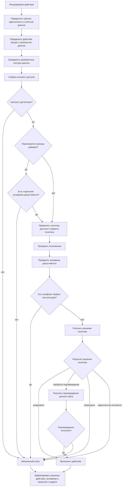

# Концептуальная онтология управления доступом для информационных систем

> Статус: `Рабочая опора`

## Назначение

Документ фиксирует типовую онтологическую схему управления доступом для информационных систем. Онтология переносима между системами и не зависит от конкретного продукта, проекта, архитектуры или набора рабочих документов.

Онтология описывает управление доступом к данным и ресурсам через контуры данных, область допустимого обращения данных, идентичности, полномочия, политики, контекст доступа, решения доступа, аудит и безопасный отказ.

Документ не описывает полную модель рисков любой ИТ-системы. Он ограничен областью управления доступом, границами данных, допустимостью действий и доказуемостью действий.

## Уровень детализации

Эта онтология является концептуальным уровнем описания управления доступом. Она стабилизирует язык предметной области, основные понятия, границы применимости и базовые смысловые отношения между объектами.

Онтология не заменяет последующие уровни детализации:

- модель требований к управлению доступом;
- архитектурную модель доступа;
- модель реализации политик и проверок;
- модель аудита и доказуемости;
- операционные процедуры, проверочные списки и матрицы полномочий.

Последующие документы могут использовать эту онтологию как общий словарь и смысловую основу, но должны отдельно фиксировать требования, архитектурные решения, алгоритмы проверки, состав аудита, правила разрешения конфликтов и порядок операционных действий.

На концептуальном уровне документ намеренно не задаёт конкретную реализацию механизма проверки доступа, формат правила политики, схему API, структуру записи аудита, жизненный цикл заявки на доступ, матрицу ролей и полномочий или порядок работы конкретной команды.

## Бизнес-риски верхнего уровня

В контексте управления доступом бизнес-риски верхнего уровня сводятся к двум нежелательным состояниям данных:

- данные или производный результат оказались вне области допустимого обращения данных;
- данные созданы, изменены или удалены без допустимого основания.

Утечка данных рассматривается как итоговый случай, при котором данные или производный результат оказались вне области допустимого обращения данных.

Остальные риски в области управления доступом являются механизмами, условиями или контролями, через которые эти бизнес-риски реализуются, предотвращаются, обнаруживаются, доказываются или локализуются.

## Трассировка к базовым свойствам информационной безопасности

Онтология управления доступом покрывает не всю область информационной безопасности, а только те аспекты конфиденциальности, целостности и доступности данных, которые зависят от допустимости действий с данными, ресурсами, идентичностями, полномочиями и контурами данных.

| Свойство | Что покрывает управление доступом | Что остаётся за пределами онтологии |
| --- | --- | --- |
| Конфиденциальность данных | Предотвращение ситуации, когда данные или производный результат оказываются вне области допустимого обращения данных. Сюда относятся чтение, передача между контурами, предоставление доступа, изменение видимости, обработка внешним ресурсом и раскрытие через производный результат. | Полная модель классификации информации, криптографическая защита, DLP, правовая модель конфиденциальности и организационные режимы секретности. |
| Целостность данных | Предотвращение создания, изменения или удаления данных без допустимого основания. Сюда относятся проверка полномочий на запись, изменение, удаление, выдачу или отзыв доступа, а также фиксация решения политики и факта действия. | Полное качество данных, семантическая корректность данных, бизнес-валидация содержания, защита от всех видов повреждения данных вне модели доступа. |
| Доступность данных | Ограниченно: обеспечение того, что допустимое действие не блокируется без причины, а отказ происходит диагностируемо и по правилам безопасного отказа. | Общая доступность сервиса, отказоустойчивость, производительность, резервирование, восстановление после сбоев и эксплуатационная надёжность. |

Аудит, артефакты управления доступом и доказуемость действий не являются отдельным свойством из триады, но поддерживают проверку конфиденциальности, целостности и ограниченного аспекта доступности в модели доступа.

## Механизмы реализации бизнес-рисков

Типовые механизмы реализации бизнес-рисков:

- недопустимое чтение данных;
- недопустимая передача данных или производного результата между контурами;
- предоставление доступа субъекту или контуру без допустимого основания;
- изменение видимости данных или производного результата без допустимого основания;
- использование идентичности, учётных данных или секрета без допустимого основания;
- выполнение действия через техническую учётную запись без доказуемого основания;
- отсутствие, неполнота или недиагностируемость аудита.

## Онтологические объекты

Онтологические объекты в этом документе описывают понятия предметной области, а не их конкретные реализации в отдельных системах. Например, `Правило политики` не равно конкретному правилу в выбранном механизме проверки доступа, `Контур данных` не равен папке или проекту, а `Аудит` не равен отдельной строке журнала без доказательной связи с действием.

| Объект                               | Рабочий смысл                                                                                                                                                                                                                                                                                                                                                                              |
| ------------------------------------ | ------------------------------------------------------------------------------------------------------------------------------------------------------------------------------------------------------------------------------------------------------------------------------------------------------------------------------------------------------------------------------------------ |
| Данные                               | Содержимое, к которому применяется доступ: код, требования, комментарии, выборки, страницы, результаты анализа, служебные материалы.                                                                                                                                                                                                                                                       |
| Ресурс                               | Объект информационной или внешней системы, над которым выполняется действие: файл, страница, задача, репозиторий, API-объект, комментарий, секрет, запись или иной управляемый объект.                                                                                                                                                                                                     |
| Контур данных                        | Область, в которой данные подчиняются общему режиму владения, видимости, чтения, создания, изменения, удаления, передачи, хранения, предоставления доступа и аудита.                                                                                                                                                                                                                       |
| Область допустимого обращения данных | Производная область, определяемая релевантными контурами данных, правилами политики, полномочиями, контекстом доступа и основаниями допустимости. Описывает, какие субъекты и действия допустимы, а также в каких ресурсах, средах и внешних ресурсах данные или производный результат могут читаться, обрабатываться, передаваться, храниться или использоваться на допустимом основании. |
| Граница доверия                      | Граница между контурами данных или режимами правил, при пересечении которой данные, действие или результат попадают под другой режим управления доступом.                                                                                                                                                                                                                                  |
| Субъект                              | Участник или система, инициирующая, подтверждающая или выполняющая действие.                                                                                                                                                                                                                                                                                                               |
| Идентичность                         | Конкретное представление субъекта в системе или внешнем ресурсе: пользователь, техническая учётная запись, сервисный принципал.                                                                                                                                                                                                                                                            |
| Роль                                 | Логическая функция субъекта в модели доступа: инициатор, исполнитель, владелец решения, владелец ресурса, подтверждающий.                                                                                                                                                                                                                                                                  |
| Полномочие                           | Разрешённая область потенциальных действий субъекта, роли или идентичности. Полномочие само по себе не является окончательным разрешением на конкретное действие.                                                                                                                                                                                                                          |
| Действие                             | Чтение, создание, изменение, удаление, передача, предоставление доступа, изменение видимости, изменение статуса результата, запуск, подтверждение, делегирование, выдача или отзыв полномочия, использование секрета или иная операция с ресурсом или данными.                                                                                                                             |
| Контекст доступа                     | Совокупность условий, влияющих на допустимость действия: субъект, идентичность, роль, ресурс, действие, контур источника, контур назначения, среда, чувствительность данных, основание действия, время, канал, состояние проверки и режим учётных данных.                                                                                                                                  |
| Политика доступа                     | Совокупность принципов, правил, ограничений, приоритетов и оснований допустимости, которые определяют, какие действия с данными и ресурсами допустимы в заданных контурах и контексте доступа.                                                                                                                                                                                            |
| Правило политики                     | Формализованное правило, по которому проверяется допустимость действия в заданном контексте доступа.                                                                                                                                                                                                                                                                                       |
| Решение политики                     | Результат проверки действия по правилам политики и контексту доступа: разрешено, запрещено, требуется подтверждение, недостаточно контекста.                                                                                                                                                                                                                                               |
| Основание допустимости               | Причина, по которой действие может быть разрешено: роль, владение ресурсом, рабочий процесс, явное согласование, ручной гейт, исключение или другое подтверждённое основание.                                                                                                                                                                                                              |
| Конфликт правил                      | Ситуация, в которой разные правила политики, контуры данных или основания допустимости дают несовместимые результаты для одного действия.                                                                                                                                                                                                                                                  |
| Передача данных между контурами      | Передача исходных данных или производного результата из одного контура данных в другой.                                                                                                                                                                                                                                                                                                    |
| Производный результат                | Данные, полученные в результате обработки исходных данных: резюме, отчёт, классификация, ревью, комментарий, рекомендация или иной результат.                                                                                                                                                                                                                                              |
| Учётные данные и секреты             | Механизм действия от имени субъекта или системы: техническая учётная запись, пользовательский секрет, ссылка на секрет, токен, ключ.                                                                                                                                                                                                                                                       |
| Внешний ресурс                       | Ресурс за пределами непосредственного доверенного контура данных: внешняя информационная система, внешний API, внешний обработчик или LLM.                                                                                                                                                                                                                                                 |
| Артефакт управления доступом         | Зафиксированный результат, запись, решение, правило, подтверждение или журнал, используемые для задания, проверки, объяснения, подтверждения, аудита или изменения доступа.                                                                                                                                                                                                                |
| Аудит                                | Доказуемая запись о решении политики, факте действия, субъекте, ресурсе, времени, основании и результате.                                                                                                                                                                                                                                                                                  |
| Безопасный отказ                     | Поведение, при котором действие запрещается или останавливается, если контекст доступа неполон, проверка недоступна, правила конфликтуют или результат проверки недиагностируем.                                                                                                                                                                                                           |

По роли в онтологии объекты можно рассматривать как:

- базовые предметные понятия: `Данные`, `Ресурс`, `Субъект`, `Идентичность`, `Действие`, `Контур данных`;
- базовые нормативные понятия: `Политика доступа`, `Полномочие`;
- производные понятия: `Область допустимого обращения данных`, `Решение политики`, `Передача данных между контурами`, `Производный результат`;
- элементы выражения и применения политики: `Правило политики`, `Основание допустимости`, `Конфликт правил`;
- доказательные и отказные понятия: `Артефакт управления доступом`, `Аудит`, `Безопасный отказ`;
- механизмы действия и выхода за контур: `Учётные данные и секреты`, `Внешний ресурс`, `Граница доверия`.

## Контуры данных

Контур данных описывает не только место хранения данных, но и режим правил, который применяется к данным в этой области.

Контур данных не равен области допустимого обращения данных. Контур данных задаёт один из режимов правил. Область допустимого обращения данных выводится из всех релевантных контуров, правил политики, полномочий, контекста доступа и оснований допустимости.

Контуры данных могут выделяться по разным основаниям.

| Категория контура данных | Основание выделения |
| --- | --- |
| Инструментальная | Данные находятся или обрабатываются в конкретной информационной системе. |
| Организационная | Данные относятся к команде, подразделению, роли ответственности или иной организационной области. |
| Продуктовая или проектная | Данные относятся к продукту, проекту, инициативе, решению или иной предметной области. |
| Средовая | Данные относятся к среде разработки, тестирования, промышленной эксплуатации или иной эксплуатационной среде. |
| Статусная | Данные, результаты или рабочие материалы различаются по состоянию: черновик, рабочий материал, согласованный результат, доступный результат, устаревший результат, отозванный результат. |
| Конфиденциальностная | Данные имеют уровень чувствительности, секретности или ограниченности распространения. |
| Регуляторная или комплаенс | Данные подчиняются внешним нормам, внутренним политикам или требованиям контроля. |

Контуры данных могут быть вложенными. Правила доступа могут задаваться для контура целиком, его части, группы объектов, отдельного объекта или фрагмента данных.

Контуры данных могут пересекаться. Один объект данных может одновременно принадлежать нескольким контурам данных, выделенным по разным основаниям.

Действие с данными допустимо только тогда, когда оно допустимо во всех релевантных контурах данных: контуре источника, контуре назначения и контурах, которые задают дополнительные правила владения, видимости, среды, статуса, конфиденциальности или контроля.

## Типовые области контроля

| Область контроля | Онтологический фокус |
| --- | --- |
| Выход за границу доверия | Передача данных или производного результата между контурами, внешний ресурс, внешний обработчик, выход данных или производного результата за область допустимого обращения данных. |
| Предметная модель доступа | Контуры данных, ресурсы, субъекты, идентичности, роли, полномочия, правила политики, учётные данные, секреты, рискованные действия и ручные гейты. |
| Управляемость и доказуемость доступа | Разделение правила политики, решения политики, факта действия, версии правила, аудита и артефактов управления доступом. |
| Безопасный отказ и диагностируемость | Поведение системы при неполном контексте доступа, конфликте правил, сбое проверки доступа или невозможности доказать результат проверки. |

## Концептуальные инварианты

В рамках этой онтологии сохраняются следующие инварианты:

- полномочие задаёт область потенциальных действий, но не является окончательным разрешением на конкретное действие;
- конкретное действие допустимо только при достаточном контексте доступа, применимой политике доступа, применимом правиле политики, релевантном полномочии и подтверждённом основании допустимости;
- действие с данными должно быть допустимо во всех релевантных контурах данных;
- пересечение границы доверия требует отдельного основания допустимости;
- производный результат наследует применимые ограничения исходных данных, если не подтверждено, что он очищен, агрегирован, обезличен или не раскрывает исходные данные;
- правило политики, решение политики, факт действия и аудит являются разными сущностями и не должны подменять друг друга;
- журнал события не является доказательством допустимости действия без связи с субъектом, ресурсом, временем, основанием, решением политики и результатом;
- неполный контекст доступа, конфликт правил, недоступная проверка или недиагностируемый результат проверки должны приводить к безопасному отказу.

## Базовые отношения

- Субъект инициирует действие.
- Субъект действует через идентичность и учётные данные.
- Действие направлено на ресурс.
- Ресурс содержит, создаёт, изменяет, удаляет, передаёт или раскрывает данные.
- Данные принадлежат одному или нескольким контурам данных.
- Контур данных задаёт режим владения, видимости, чтения, создания, изменения, удаления, передачи, хранения, предоставления доступа и аудита.
- Для данных и производных результатов определяется область допустимого обращения данных.
- Область допустимого обращения данных выводится из релевантных контуров данных, правил политики, полномочий, контекста доступа и оснований допустимости.
- Полномочие ограничивает потенциальные действия субъекта, роли или идентичности.
- Политика доступа задаёт общий режим допустимости действий с данными и ресурсами.
- Политика доступа выражается через правила политики, ограничения, приоритеты и основания допустимости.
- Правило политики является формализованной частью политики доступа.
- Допустимость конкретного действия определяется полномочиями, правилами политики, контекстом доступа, релевантными контурами данных и основанием допустимости.
- Решение политики является результатом применения политики доступа и правил политики к конкретному контексту доступа.
- Полномочие на чтение, создание, изменение, удаление, передачу, предоставление доступа, изменение видимости, изменение статуса результата, запуск, подтверждение, делегирование, выдачу или отзыв полномочия и использование секрета проверяется отдельно.
- Действие может пересекать границу доверия.
- Пересечение границы доверия требует отдельного основания допустимости.
- Передача данных или производного результата между контурами требует проверки источника, назначения, состава данных, основания передачи, режима учётных данных и аудита.
- Недопустимая передача данных между контурами является одним из типовых механизмов утечки данных.
- Утечка данных возникает, когда данные или производный результат оказываются вне области допустимого обращения данных.
- Создание, изменение, удаление, предоставление доступа или изменение статуса результата изменяет состояние контура данных.
- Производный результат может раскрывать исходные данные и должен наследовать применимые ограничения исходных данных.
- Производный результат должен получать не более слабый режим доступа, чем наиболее ограничивающий исходный контур данных, если не подтверждено, что результат очищен, агрегирован, обезличен или не раскрывает исходные данные.
- Секреты и учётные данные не должны раскрываться как данные обычного результата.
- Правило политики, решение политики, факт действия и аудит являются разными артефактами управления доступом.
- Журнал события не равен доказательству допустимости действия без связи с субъектом, ресурсом, временем, основанием, решением политики и результатом.
- При неполном контексте доступа, конфликте правил, недоступной проверке или недиагностируемом результате проверки применяется безопасный отказ.

## Визуальные представления базовых отношений

## Концептуальная карта объектов

```mermaid
flowchart LR
    Subject["Субъект"] -->|действует через| Identity["Идентичность"]
    Identity -->|использует| Credentials["Учётные данные и секреты"]
    Subject -->|инициирует| Action["Действие"]
    Action -->|направлено на| Resource["Ресурс"]
    Resource -->|содержит или изменяет| Data["Данные"]

    Data -->|принадлежат| DataContour["Контур данных"]
    DataContour -->|участвует в определении| AllowedArea["Область допустимого обращения данных"]
    Data -->|может породить| DerivedResult["Производный результат"]
    DerivedResult -->|наследует ограничения| DataContour

    AccessPolicy["Политика доступа"] -->|выражается через| PolicyRule["Правило политики"]
    AccessPolicy -->|регулирует| Permission["Полномочие"]
    AccessPolicy -->|учитывает| AllowedBasis["Основание допустимости"]

    ActionContext["Контекст доступа"] -->|включает| Subject
    ActionContext -->|включает| Identity
    ActionContext -->|включает| Action
    ActionContext -->|включает| Resource
    ActionContext -->|включает| DataContour

    PolicyRule -->|применяется к| ActionContext
    Permission -->|учитывается при проверке| ActionContext
    AllowedBasis -->|учитывается при проверке| ActionContext
    ActionContext -->|даёт основание для| PolicyDecision["Решение политики"]

    Action -->|может пересекать| TrustBoundary["Граница доверия"]
    TrustBoundary -->|требует отдельного основания| AllowedBasis
    DataTransfer["Передача данных между контурами"] -->|пересекает| TrustBoundary
    DataTransfer -->|затрагивает| Data
    DataTransfer -->|связывает контуры| DataContour

    PolicyRule -->|может фиксироваться как| AccessArtifact["Артефакт управления доступом"]
    PolicyDecision -->|может фиксироваться как| AccessArtifact
    Action -->|фиксируется в| Audit["Аудит"]
    PolicyDecision -->|фиксируется в| Audit
    Audit -->|поддерживает доказуемость| AccessArtifact

    Conflict["Конфликт правил"] -->|ведёт к| SafeDeny["Безопасный отказ"]
    PolicyDecision -->|при недостатке контекста ведёт к| SafeDeny
```

## Логика проверки допустимости действия

## Артефакты управления доступом

Артефакт управления доступом фиксирует управленческий, доказательный или операционный смысл в области доступа.

К типовым артефактам управления доступом относятся:

- правило политики;
- версия правила политики;
- матрица ролей и полномочий;
- решение политики;
- подтверждение ручного гейта;
- основание предоставления доступа;
- заявка на доступ;
- решение о выдаче, изменении или отзыве доступа;
- запись аудита;
- журнал действия, если он связан с субъектом, ресурсом, временем, основанием и результатом;
- результат проверки доступа;
- отчёт по инциденту доступа.

Обычный документ, код, комментарий, AI-результат или рабочий материал не является артефактом управления доступом сам по себе. Он становится релевантным для управления доступом, если задаёт правило доступа, фиксирует решение, подтверждает основание, меняет полномочие, используется в аудите или служит доказательством действия.

## Проверочные вопросы

Для оценки допустимости действия в типовой информационной системе нужно ответить на вопросы:

- Кто является субъектом действия?
- Через какую идентичность действует субъект?
- Какие учётные данные или секреты используются?
- Какое действие выполняется?
- На какой ресурс направлено действие?
- Какие данные затрагиваются действием?
- К каким контурам данных относятся эти данные?
- Какова область допустимого обращения этих данных или производного результата?
- Есть ли контур источника и контур назначения?
- Пересекается ли граница доверия?
- Какое правило политики применяется?
- Какое полномочие подтверждает потенциальную допустимость действия?
- Какое основание допустимости используется?
- Есть ли конфликт правил или контуров?
- Какое решение политики получено?
- Что должно попасть в аудит?
- Что происходит при неполном контексте, недоступной проверке или конфликте правил?

## Границы применимости

Эта онтология применима как типовой слой для информационных систем, где есть данные, ресурсы, субъекты, идентичности, действия, полномочия, политики, секреты, контуры данных, область допустимого обращения данных, внешние ресурсы, аудит и безопасный отказ.

Она не покрывает всю область рисков ИТ-систем. За её пределами остаются, например:

- общая доступность сервиса, отказоустойчивость и производительность;
- стоимость эксплуатации;
- UX и операционная эффективность;
- качество данных;
- качество AI-результатов и галлюцинации LLM;
- физическая безопасность;
- полная правовая и комплаенс-модель;
- надёжность внешних интеграций как отдельная эксплуатационная область.

Онтология может быть основой для требований, архитектурных решений, проверочных списков и модели доказуемости доступа, но не является сама по себе реализацией, матрицей прав, политикой безопасности, доказательством комплаенса или результатом аудита.
